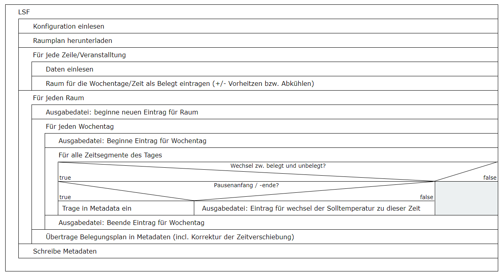

# LSF-Schnittstelle
This is a Part of the Project SVEN
See https://projekt-sven.github.io/ for more Info

## Aufgabe der Schnittstelle
Um die Heizung optimal anzusteuern und für die Studenten eine optimale Lernumgebung zu schaffen, ist es wichtig, die Räume entsprechend des Stundenplans vorzuheizen und die Solltemperatur rechtzeitig wieder zu senken, wenn der Raum später nicht mehr genutzt wird. Die erforderlichen Informationen liegen für die Hochschule bereits in digitaler Form im LSF vor. Dieses verfügt eigentlich auch über Schnittstellen um diese Daten auszulesen, jedoch sind diese aus den Netzen, in denen wir arbeiten, leider nicht erreichbar. Daher werden die notwendigen Daten uns nach Absprache mit dem Verantwortlichen der Hochschule als Textdatei auf einem hochschulinternen Webserver bereitgestellt. Diese Datei wird täglich gegen 3 Uhr morgens neu generiert, um ihre Aktualität zu gewährleisten. Diese Datei enthält für jede Veranstaltung: Veranstaltungsnummer, Name, Startdatum, Enddatum, Vorlesungsbeginn, Vorlesungsende, Wochentag, Turnus und den Raum. Jede Zeile der Datei entspricht einer Vorlesung und die einzelnen Werte sind durch senkrechte Linien getrennt. 

Abbildung 1: Strukturgramm des Programmes zum einlesen der LSF-Schnittstelle 

Diese Datei wird jeden Morgen um 3:15 durch ein C#-Programm eingelesen, welches aus FHEM aus gestartet wird. Dieses Liest alle Veranstalltungen ein und generiert daraus die Belegung der Räume. Danach wird für jeden Raum ein Eintrag im Heizplan erstellt, in welchem dann auch Zeiten zum Vorheitzen, Abkühlen und überbrücken von Pausen berücksichtigt sind. Zusätzlich wird noch eine zweite Datei mit den Pausenzeiten und den Zeiten der Belegung der Räume generiert. 

Anzumerken ist, dass Veranstaltungen, die nur 14-tägig stattfinden, aktuell trotzdem als wöchentlich angesehen werden, da es mit den aktuellen Daten nicht möglich ist den Turnus festzustellen und eine Anforderung zusätzlicher Daten durch die Corona-Situation während der Entwicklung erschwert wurde. Zudem werden Veranstaltungen ignoriert, die kein Beginn festgelegt haben, da diese ohne weitere Informationen ebenfalls nicht verarbeitet werden können. 
